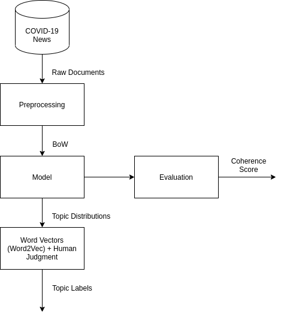

# (Work in Progress) Comparative Between Topic Modeling Techniques

Study conducted with the purpose of evaluate the performance of different topic modeling techniques, namely NMF (Non-Negative Matrix Factorization), LSI (Latent Semantic Indexing), LDA (Latent Dirichlet Allocation) and lda2vec.

**Note:** For now, only NMF model is implemented. Other models will be implemented soon.

# Experiments Setup

The first stage of the experiments aimed at obtaining an optimal preprocessing pipeline. For such, ?six? different preprocessing setups were used. Three of them are n-grams (brigrams, trigrams and fourgrams) and the other three are using spaCy's [merge_noun_chunks](https://spacy.io/api/pipeline-functions#merge_noun_chunks), [merge_entities](https://spacy.io/api/pipeline-functions#merge_entities) and both of them. Additionally, these setups could keep the digits in original text (converted to literals) or not, resulting in [12 different preprocessed files](data/preprocessed). To select the best among them, manual inspection and model inference with different files were combined, from which the bigram without digits was selected for the rest of the experiment.

In general, the following pipeline is used for testing every model:

Raw documents are preprocessed and them fed to a model using the Bag of Words representation. After the training, topic distributions are given to a Word2Vec model previously trained on the preprocessed text. Coherence score was used for evaluation, nevertheless, topic labels proved to be more effective for comparative purposes. Finally, topic distributions and similiraty queries - performed using topic words in the full corpus - are used for topic labeling.